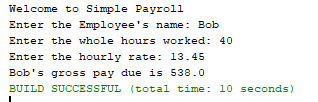

## Assignment 1

- ### Assignment: 

  - Write a simple payroll application that operates similarly to the attached graphic. Copy your source code into an ordinary Word document (pay attention to the line spacing) for submission into Canvas. Do not concern yourself with input conversion errors at this time.

- ### Purpose: 

  - Understand the fundamental concepts of creating a Java application and getting/using input from the user

- ### Sample Output
	
