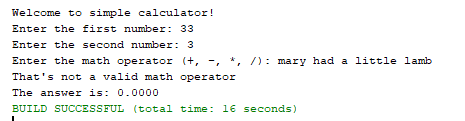

## Assignment 2

- ###Assignment: 

 - Write a simple 4-function calculator that operates similar to the attached graphic. If an invalid math operator is provided, display a message similar to the attached graphic. Do not concern yourself with input conversion errors or math errors at this time.

- ###Purpose: 

  - Understand input conversion, branching, and format specifiers

- ###Sample Output
	
	