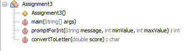

## Assignment 3

- ### Assignment: 

 	- Write a grade book application that works similarly to the sample output graphic. You must use methods as shown in the class diagram. Do not concern yourself with input conversion errors at this time.

- ### Purpose: 

  - To learn loops, constants, accumulation, integer math, the "range problem", and the proper use of methods

- ### Sample Output
	
- ### Class Diagram
	