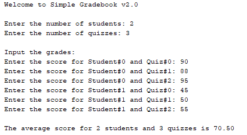
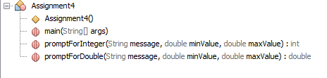
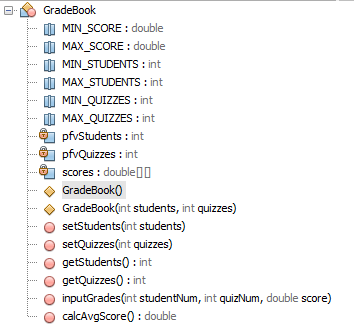

## Assignment 4

- ###Assignment: 

 - Write a Grade Book application that operates similarly to this graphic. Please refer to this class diagram for the parts of the Assignment4 class, and this class diagram for the parts of the GradeBook class. Do not concern yourself with input conversion errors at this time

- ###Purpose: 

  - Understand classes, constructors, properties, access modifiers, class layout, input validation, and arrays

- ###Sample Output
	
	

- ###Class Diagram
	
	