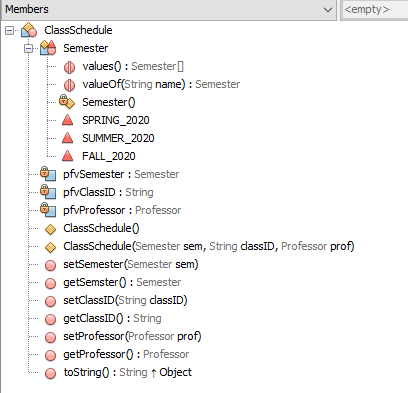

## Assignment 5

- ###Assignment: 

 - This assignment is in two parts. Part 1: Create a Professor and ClassSchedule object and use their toString() methods to show they work.  Follow the best practices for input validation as discussed in lecture. Part 2: Enter some text to search and then perform a search that yields the locations found (if any).  Take a look at sample output of the application.  Take a look at the class diagrams for help on where to place portions of your code

- ###Purpose: 

  - Part 1: To demonstrate your understanding of Composition and Enums; Part 2: To demonstrate your understanding string searching

- ###Sample Output
	
	

- ###Class Diagram
	
	
	