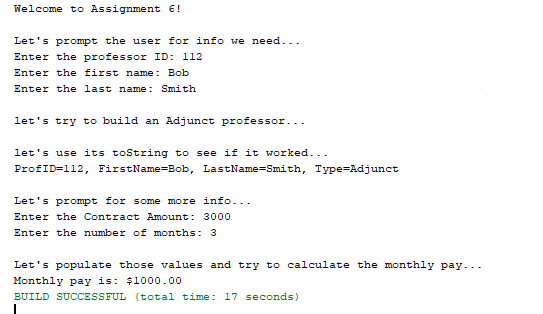
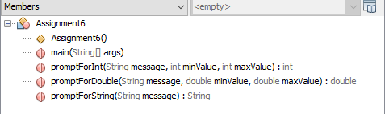
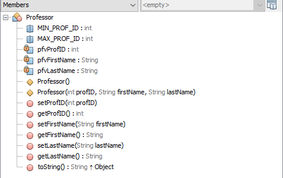
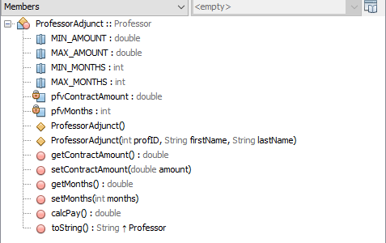

## Assignment 6

- ### Assignment: 

 	- Write an application that operates similarly to the following graphic. Take a look at the class diagrams.

- ### Purpose: 

  - To demonstrate your understanding of inheritance and exception handling

- ### Sample Output
	
	

- ### Class Diagram
	
	
	